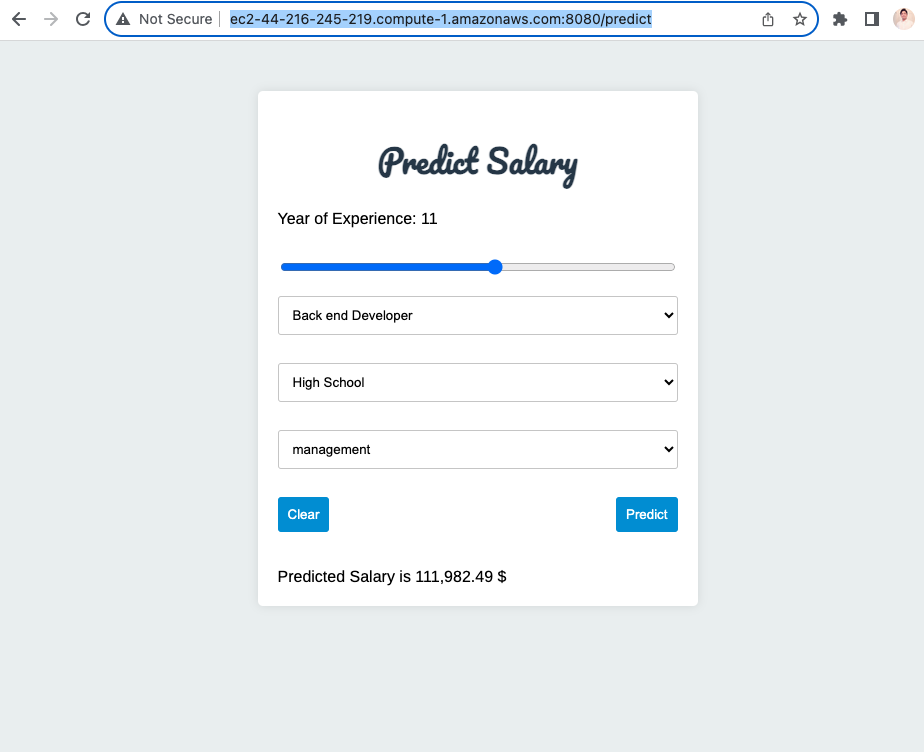

# Salary Prediction Application

## Overview

This project is a web application that predicts salaries based on input features. It utilizes a Random Forest machine learning model trained on a dataset of job-related information. The application is containerized using Docker for easy deployment.

## Table of Contents

- [Getting Started](#getting-started)
  - [Prerequisites](#prerequisites)
  - [Installation](#installation)
- [Usage](#usage)
- [Project Structure](#project-structure)
- [Training and Evaluation](#training-and-evaluation)
- [Docker Deployment](#docker-deployment)
- [Continuous Integration](#continuous-integration)
- [Contributing](#contributing)

## Getting Started

### Prerequisites

- Python 3.x
- Docker

### Installation

1. Clone the repository:

   ```bash
   git clone https://github.com/shaficse/SalaryPrediction.git
   ```
2. Install dependencies
   ```
   pip install -r app/requirements.txt
   ```
### Usage
1. Run the Flask application:
    ```
   python app.py
    ```
2. Open the web application at http://127.0.0.1:8080/ in your browser.
  
   We deployed in AWS EC2 Instance.
  

3. Enter the required information and click "Predict" to get salary predictions.

### Project Structure
  
- **app/**
  - *app.py*: Main Flask application.
  - *templates/*: HTML templates.
  - *best_model.pkl*: Trained Random Forest model.
  - *scaler.pkl*: Scaler used for feature scaling.
  - *test.py*: Unit tests for the application.
  - *requirements.txt*: List of Python dependencies.


- *docker-compose.yml*: Docker Compose file for deployment.
- *Dockerfile*: Dockerfile for building the application image.
- **.github/workflows/**
  - *deploy.yml*: GitHub Actions workflow for continuous integration and deployment.
  

## Training and Evaluation
The Random Forest model for salary prediction was trained on a dataset, and the following metrics were obtained on the testing data:

#### Training Data Metrics for Best Model

- **Best Mean MSE:** 0.030542776154268658
- **Best R² Score:** 0.9083271720150675

#### Testing Data Metrics

- **Mean Squared Error (MSE):** 0.041120305776682374
- **R² Score:** 0.8665806740573799

These metrics provide insights into the performance and generalization capability of the Random Forest model.

The model demonstrates strong predictive accuracy on the testing data, as evidenced by the low MSE and high R² Score.

 ## Docker Deployment
Need to open terminal or command prompt and navigate to ```app`` directory where the docker-compose.yml and Dockerfile are located. And run the below command 
  ```sh
    docker compose up --build
  ```

# Continuous Integration

The project utilizes GitHub Actions for continuous integration. The workflow is defined in [.github/workflows/deploy.yml](.github/workflows/deploy.yml). This workflow automates the following tasks:

1. **Unit Tests:** Ensure the reliability and correctness of the application through automated unit tests defined in the app directory.

2. **Docker Image Building and Pushing:** Automatically build a Docker image of the application and push it to Docker Hub.

3. **Continuous Deployment:** The workflow is triggered on each push to the main branch. It ensures that changes are automatically tested and deployed, maintaining a reliable and up-to-date application in an AWS EC2 instance.

## Setting Up GitHub Actions

To set up GitHub Actions for your repository, ensure that you have the following in place:

1. **Unit Tests:** Write unit tests for your application and place them in the app directory.

2. **GitHub Actions Workflow:** Define your GitHub Actions workflow in a YAML file, typically located in the `.github/workflows/` directory. For example, [.github/workflows/deploy.yml](.github/workflows/deploy.yml).

3. **Docker Hub Secrets:** Configure the required secrets in your GitHub repository settings:
   - `DOCKER_USERNAME`: Your Docker Hub username.
   - `DOCKER_PASSWORD`: Your Docker Hub password.

With these secrets set, GitHub Actions will automatically trigger the defined workflow on each push to the main branch. It ensures continuous integration, testing, and deployment of your application.

Feel free to customize the workflow or add additional steps based on your project's specific requirements.


## Contributing
- [Md Shafi Ud Doula](https://github.com/shaficse)
- [Tanzil Al Sabah](https://github.com/tanziltonmoy)
- [Munthitra](https://github.com/Munthitra)
- [Anawat](https://github.com/AndromedaPirate)
- [Chatpol-Phongyen](https://github.com/Chatpol-Phongyen)
- [Ritik](https://github.com/RitikSareen)
